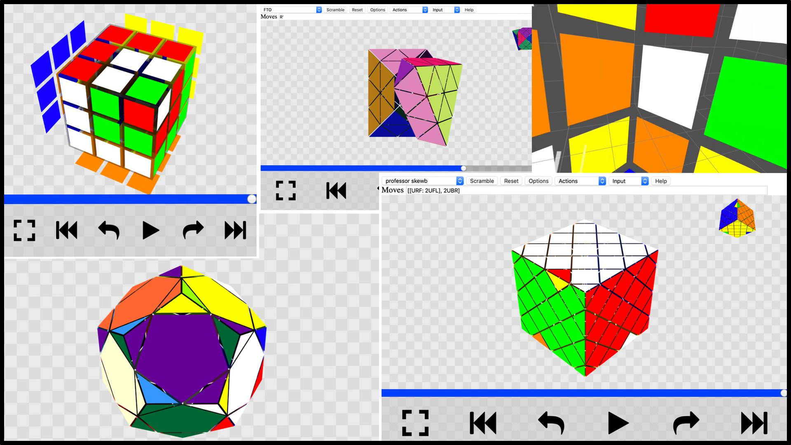

# `cubing.js`

`cubing.js` is a collection of Javascript libraries, still under development.

| Library | Purpose |
|---------|---------|
| `cubing/alg` | Parse and transform twisty puzzle algorithms ("algs"). |
| `cubing/bluetooth` | Connect to bluetooth twisty puzzles. |
| `cubing/kpuzzle` | Represent and transform twisty puzzles. |
| `cubing/twisty` | Animate and interact with twisty puzzles. |
| `cubing/puzzle-geometry` | Generate new twisty puzzle geometries. |

## Development

    git clone https://github.com/cubing/cubing.js && cd cubing.js
    npm install
    make dev

This should open http://localhost:1234/ automatically.
